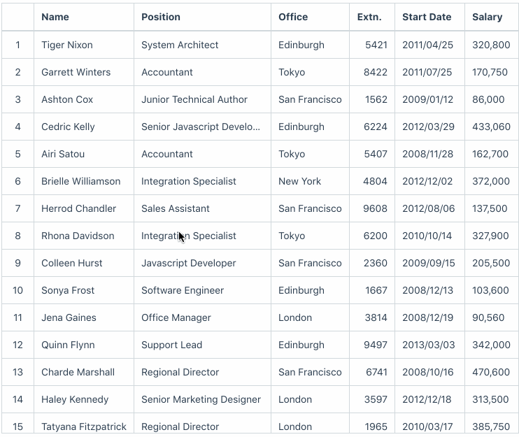

<datatable-basic />

## Installation

```bash
# Install using yarn
$ yarn add frappe-datatable

# or NPM
$ npm install frappe-datatable
```

## Usage

```javascript
import DataTable from 'frappe-datatable';

// or add
// <script src="frappe-datatable.js" ></script>
// in your html

let datatable = new DataTable({
    columns: ['Name', 'Position', ...],
    data: [
        ['Tiger Nixon', 'System Architect', ...],
        ['Garrett Winters', 'Accountant', ...],
        ...
    ]
});
```

## Cell Features

* Custom Formatters
* Inline Editing
* Mouse Selection
* Copy Cells
* Keyboard Navigation
* Custom Cell Editor



## Column Features

* Reorder Columns
* Sort by Column
* Remove / Hide Column
* Custom Actions
* Resize Column
* Flexible Layout


## Row Features

* Row Selection
* Tree Structured Rows
* Inline Filters
* Large Number of Rows
* Dynamic Row Height


<div class="footer">
Made with ❤️ by Frappe
</div>

<style>
    .theme-container.no-sidebar .home {
        max-width: 740px;
    }
    .datatable {
        font-size: 14px;
    }
    tr:nth-child(2n) {
        background-color: transparent;
    }
    .content.custom > div {
        /* height: 2000px; */
    }
    .home .hero .description {
        max-width: 30rem;
        font-size: 2rem;
        margin-bottom: 4rem;
    }
</style>